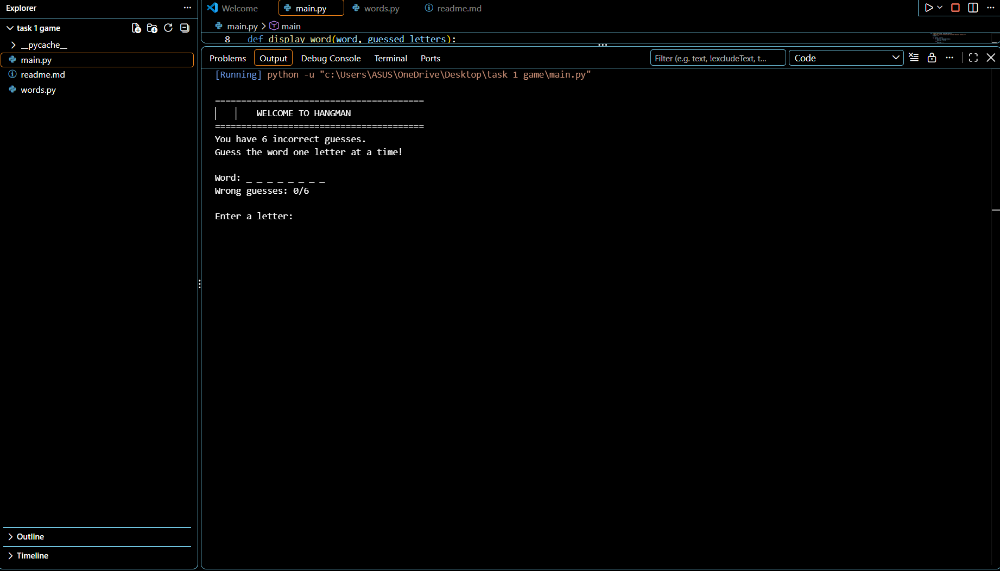
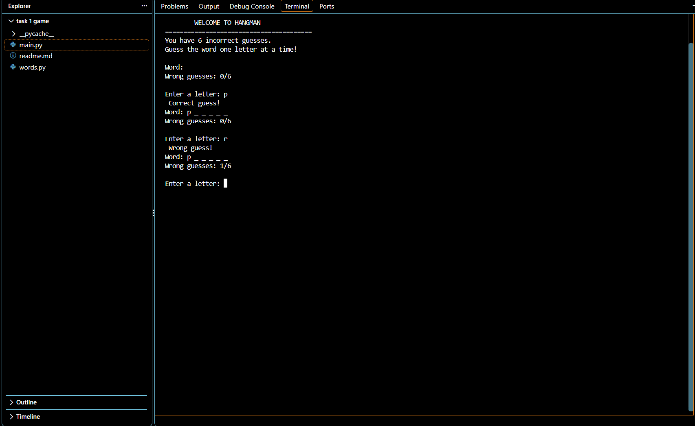
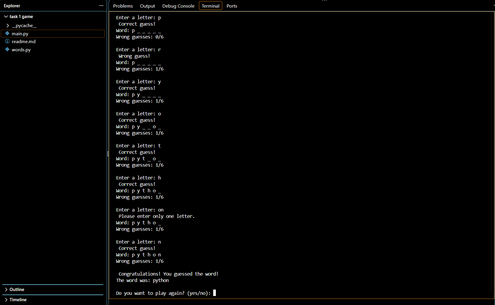

#  CodeAlpha Hangman Game
A simple text-based Hangman game developed in Python as part of the **CodeAlpha Python Programming Internship**.

##  About the Project
Hangman is a word-guessing game where the player tries to guess a hidden word one letter at a time.
The game randomly selects a word from a list of five predefined words. The player can make a maximum of **6 incorrect guesses** before the game ends.

##  Features
*  Random word selection
*  5 predefined words
*  Letter-by-letter guessing
*  Maximum 6 incorrect guesses
*  Prevents repeated guesses
*  Input validation
*  Win and lose conditions
*  Replay option
*  Simple console-based interface

##  Technologies Used
* Python
* `random` module
* Lists
* Strings
* Loops
* Conditional statements
* Functions

##  Project Structure
CodeAlpha_HangmanGame/
│
├── main.py
├── words.py
├── README.md


##  How to Run
### 1. Clone the repository
```bash
git clone YOUR_GITHUB_REPOSITORY_URL
```
### 2. Open the project folder

```bash
cd CodeAlpha_HangmanGame
```
### 3. Run the game

```bash
python main.py
```

##  How to Play
1. Start the game.
2. The computer randomly selects a word.
3. Guess one letter at a time.
4. Correct letters are revealed.
5. Incorrect guesses are counted.
6. You have a maximum of 6 incorrect guesses.
7. Guess the complete word before reaching the limit to win.
8. Choose whether you want to play again.

##  Screenshots
### Game Start

### Correct and Wrong Guesses

### Winning Screen



##  Internship Task
This project was created as **Task 1 — Hangman Game** for the CodeAlpha Python Programming Internship.
The task focuses on:
* Random selection
* While loops
* If-else conditions
* Strings
* Lists
* Console input/output

##  Author
*Paridhi Agrawal*

